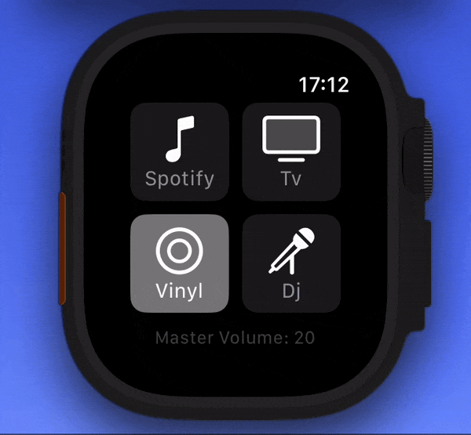

# Onkyo Controller

Apple watch as a physical interface to my Onkyo TX-L20D amplituner.  

## Features
 - Turning the AV receiver on/off
 - Volume and bass level control via digital crown (satisfying haptic feedback)
 - Switching between profiles (presets of audio source, default volume, default bass level, max volume)

## How it works?

A simple go program implements onkyo-eiscp protocol and serves JSON-based API for the watch app.

## Acknowledgments

Special thanks to [onkyo-eiscp](https://github.com/miracle2k/onkyo-eiscp) for sharing the protocol details.
